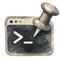

<div align="center">


# Terminal Pinner (toggle_shell.sh)
</div>


A pinned terminal for Linux tested on Linux Mint (Cinnamon). Press a single keybinding and get the same terminal window every time, docked in a fixed spot on screen, instead of a new window spawning each time.

## What it does

- `Ctrl+Alt+T` opens the terminal if it's not running, or focuses the existing one if it is, instead of always spawning a new window.
- The terminal launches at a fixed, calibrated position and size (bottom-right corner by default).
- Guards against double-launches: if the keybinding fires twice in quick succession (e.g. a stuck or double-pressed key), a lock file (`/tmp/toggle_shell.sh.lock`) makes the second invocation exit immediately instead of racing the first one and potentially spawning a duplicate window. (flock is such a cool cmd :astonished:)

## Requirements

- Linux Mint / Cinnamon (X11)
- `gnome-terminal`
- `wmctrl`
- `xdotool`

Install everything:

```bash
sudo apt install wmctrl xdotool
```

## Files

- **`toggle-terminal.sh`** - the main script. Bind this to `Ctrl+Alt+T`. Finds the pinned terminal if it exists and focuses it; otherwise launches it, positions it, and sizes it.
- **`calibrate.sh`** - a helper script. Launches (or grabs) the pinned terminal so you can manually drag/resize it to where you want, then prints the exact `POS_X`, `POS_Y`, `WIN_W`, `WIN_H` values to paste into `toggle-terminal.sh`.

Note `calibrate.sh` is basically the same as `toggle-terminal.sh` but with extra steps that `toggle-terminal.sh` hardcodes. You can use `calibrate.sh` if you'd like, but it is much slower and less convenient than just hardcoding the values into `toggle-terminal.sh` once you have the correct values. If your setup often changes (e.g. you move monitors around), you can run `calibrate.sh` again to get new values or just keep using `calibrate.sh` instead of `toggle-terminal.sh` if you don't mind the extra steps.

## Setup

1. Clone or copy this project somewhere

2. Make the scripts executable:
   ```bash
   chmod +x toggle-terminal.sh calibrate.sh
   ```

3. Run `calibrate.sh` once with no pinned terminal open. It will launch one:
   ```bash
   bash calibrate.sh
   ```

4. (Optional) You may drag and resize the window to exactly where you want it.

5. Run `calibrate.sh` again. It will detect the existing window and print something like:
   ```bash
   POS_X=3544
   POS_Y=2074
   WIN_W=1596
   WIN_H=786
   ```

6. Paste those four values into the top of `toggle-terminal.sh`, replacing the placeholder values.

7. In Cinnamon, go to **Menu → Keyboard → Shortcuts**, disable the default `Ctrl+Alt+T` terminal launcher, and add a new custom shortcut:
   - Name: `Pinned Terminal`
   - Command: `/full/path/to/toggle-terminal.sh`
   - Keybinding: `Ctrl+Alt+T`

## Known quirks

- **Phantom window:** gnome-terminal sometimes creates a second, invisible helper window sharing the same `WM_CLASS`. Both scripts filter for this by taking the last matching window ID (`tail -1`), which has worked reliably in testing, but if you ever see the wrong window get grabbed, check `xdotool getwindowname <id>` on each match to confirm which is real.
- **Fractional/HiDPI scaling:** on scaled displays, coordinates measured via `xdotool` are in Cinnamon's logical coordinate space, not the raw framebuffer resolution reported by `xrandr`. Always calibrate using `calibrate.sh` rather than computing positions from `xrandr` output directly.
- Closing the window closes the shell session. There's no persistence layer, if you want your session to survive a close, that would need to be added separately (e.g. by wrapping the launch command in tmux yourself).

## License

MIT (or whatever you'd like, this is yours to do with as you please)
